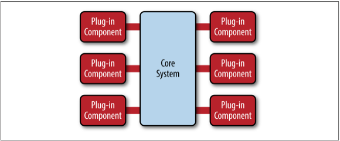
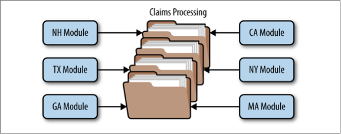

# 第三章 微内核架构

The microkernel architecture pattern (sometimes referred to as the plug-in architecture pattern) is a natural pattern for implementing product-based applications. A product-based application is one that is packaged and made available for download in versions as a typical third-party product. However, many companies also develop and release their internal business applications like software products, complete with versions, release notes, and pluggable features. These are also a natural fit for this pattern. The microkernel architecture pattern allows you to add additional application features as plug-ins to the core application, providing extensibility as well as feature separation and isolation.

微内核架构模式(也称为插件化应用架构)对于基于产品的应用程序来说是一个很自然的选择。基于产品的应用是指一个经过打包的、可以通过版本下载的一个典型的第三方产品。然而，很多公司也会开发和发布他们的内部商业软件，完整的版本号、发布日志和可插拔的新特性，这些就非常符合微内核架构的思想。微内核架构模式可以通过插件的形式添加额外的特性到核心系统中，这提供了很好的扩展性，也使得新特性与核心系统隔离开来。( 译者注: 比如，著名的Eclipse IDE就是基于插件化开发的，eclipse核心更像是一个微内核，或者我们可把它叫做开放平台，其他的功能通过安装插件的形式添加到eclipse中。 )

## Pattern Description 模式描述
The microkernel architecture pattern consists of two types of archi‐ tecture components: a core system and plug-in modules. Application logic is divided between independent plug-in modules and the basic core system, providing extensibility, flexibility, and isolation of application features and custom processing logic. Figure 3-1 illustrates the basic microkernel architecture pattern.    

微内核架构主要需要考虑两个方面: 核心系统和插件模块。应用逻辑被划分为独立的插件模块和核心系统，这样就提供良好的可扩展性、灵活性，应用的新特性和自定义处理逻辑也会被隔离。图3-1演示了基本的微内核架构。

The core system of the microkernel architecture pattern tradition‐ ally contains only the minimal functionality required to make the system operational. Many operating systems implement the micro‐ kernel architecture pattern, hence the origin of this pattern’s name. From a business-application perspective, the core system is often defined as the general business logic sans custom code for special cases, special rules, or complex conditional processing.

微内核架构的核心系统一般情况下只包含一个能够使系统运作起来的最小化模块。很多操作系统的实现就是使用微内核架构，因此这也是该架构名字的由来。从商业应用的角度看，核心系统通常是为特定的使用场景、规则、或者复杂条件处理定义了通用的业务逻辑，而插件模块根据这些规则实现了具体的业务逻辑。


图 3-1. 微内核架构

The plug-in modules are stand-alone, independent components that contain specialized processing, additional features, and custom code that is meant to enhance or extend the core system to produce additional business capabilities. Generally, plug-in modules should be independent of other plug-in modules, but you can certainly design plug-ins that require other plug-ins to be present. Either way, it is important to keep the communication between plug-ins to a minimum to avoid dependency issues.    

插件模块是一个包含专业处理、额外特性的独立组件，自定义代码意味着增加或者扩展核心系统以达到产生附加的业务逻辑的能力。通常，插件模块之间应该是没有任何依赖性的，但是你也可以设计一个需要依赖另一个插件的插件。但无论如何，使得插件之间可以通信的同时避免插件之间产生依赖又是一个特别重要的问题。

The core system needs to know about which plug-in modules are available and how to get to them. One common way of implementing this is through some sort of plug-in registry. This registry contains information about each plug-in module, including things like its name, data contract, and remote access protocol details (depending on how the plug-in is connected to the core system). For example, a plug-in for tax software that flags high-risk tax audit items might have a registry entry that contains the name of the service (AuditChecker), the data contract (input data and output data), and the contract format (XML). It might also contain a WSDL (Web Services Definition Language) if the plug-in is accessed through SOAP.  

核心系统需要了解插件模块的可用性以及如何获取到它们。一个通用的实现方法是通过一组插件注册表。这个插件注册表含有每个插件模块的信息，包括它的名字、数据规约和远程访问协议(取决于插件如何与核心系统建立连接)。例如，一个税务软件的用于标识高风险的税务审计插件可能会有一个含有插件名(比如AuditChecker)的注册入口，数据规约(输入数据、输出数据)和规约格式( 比如xml )。如果这个插件是通过SOAP服务访问，那么它可能会包含一个WSDL (Web Services Definition Language).

Plug-in modules can be connected to the core system through a variety of ways, including OSGi (open service gateway initiative), messaging, web services, or even direct point-to-point binding (i.e., object instantiation). The type of connection you use depends on the type of application you are building (small product or large business application) and your specific needs (e.g., single deploy or distributed deployment). The architecture pattern itself does not specify any of these implementation details, only that the plug-in modules must remain independent from one another.   

插件模块可以通过多种方式连接到核心系统，包括OSGi ( open service gateway initiative )、消息机制、web服务或者直接点对点的绑定 ( 比如对象实例化，即依赖注入 )。你使用的连接类型取决于你构建的应用类型和你的特殊需求（比如单机部署还是分布式部署）。微内核架构本身没有指定任何的实现方式，唯一的规定就是插件模块之间不要产生依赖。

The contracts between the plug-in modules and the core system can range anywhere from standard contracts to custom ones. Custom contracts are typically found in situations where plug-in components are developed by a third party where you have no control over the contract used by the plug-in. In such cases, it is common to create an adapter between the plug-in contact and your standard con‐ tract so that the core system doesn’t need specialized code for each plug-in. When creating standard contracts (usually implemented through XML or a Java Map), it is important to remember to create a versioning strategy right from the start.

插件和核心系统的通信规范包含标准规范和自定义规范。自定义规范典型的使用场景是插件组件是被第三方构建的。在这种情况下，通常是在第三方插件规约和你的标准规范创建一个Adapter来使核心系统根本不需要知道每个插件的具体细节。当创建标准规范 ( 通常是通过XML或者Java Map )时，从一开始就创建一个版本策略是非常重要的。 

## Pattern Examples 架构示例
Perhaps the best example of the microkernel architecture is the Eclipse IDE. Downloading the basic Eclipse product provides you little more than a fancy editor. However, once you start adding plug-ins, it becomes a highly customizable and useful product. Internet browsers are another common product example using the microkernel architecture: viewers and other plug-ins add additional capabilities that are not otherwise found in the basic browser (i.e., core system).    

也许微内核架构的最好示例就是大家熟知的Eclipse IDE了。下载最基本的Eclipse后，它只能提供一个编辑器。然后，一旦你开始添加插件，它就变成一个高度可定制化和非常有用的产品（译者注 : 更多内容大家可以参考 [开源软件架构 卷1：第6章 Eclipse之一](http://www.ituring.com.cn/article/6817) ）。浏览器是另一个使用微内核架构的产品示例，它由一个查看器和其他扩展的插件组成。


The examples are endless for product-based software, but what about large business applications? The microkernel architecture applies to these situations as well. To illustrate this point, let’s use another insurance company example, but this time one involving insurance claims processing. 

基于微内核架构的示例数不胜数，但是大型的商业应用呢？微内核应用架构也适用于这些情形。为了阐述这个观点，让我们来看看另一个保险公司的示例，但是这次的示例会涉及保险赔偿处理。  

Claims processing is a very complicated process. Each state has different rules and regulations for what is and isn’t allowed in an insurance claim. For example, some states allow free windshield replacement if your windshield is damaged by a rock, whereas other states do not. This creates an almost infinite set of conditions for a standard claims process.    

赔偿处理是一个非常复杂的过程。每个州都有不同的关于保险赔偿的规则和条文。例如一些州允许在你的挡风玻璃被石头砸碎时免费进行替换，但是一些州则不是这样。因为大家的标准都不一样，因此赔偿标准几乎可以是无限的。

Not surprisingly, most insurance claims applications leverage large and complex rules engines to handle much of this complexity. How‐ ever, these rules engines can grow into a complex big ball of mud where changing one rule impacts other rules, or making a simple rule change requires an army of analysts, developers, and testers. Using the microkernel architecture pattern can solve many of these issues.   

有很多保险赔偿应用运用大型和复杂的规则处理引擎来处理不同规则带来的复杂性。然而，可能会因为某条规则的改变而引起其他规则的改变而使得这些规则处理引擎变成一个大泥球，或者使简单需求变更会需要一个很大的分析师、工程师、测试工程师来进行处理。使用微内核架构能够很好的解决这个问题，核心系统只知道根据赔偿规则处理，但这个赔偿规则是抽象的，系统将赔偿规则作为一个插件规范，具体的规则有对应的实现，然后注入到系统中即可。

The stack of folders you see in Figure 3-2 represents the core system for claims processing. It contains the basic business logic required by the insurance company to process a claim, except without any custom processing. Each plug-in module contains the specific rules for that state. In this example, the plug-in modules can be implemented using custom source code or separate rules engine instances. Regardless of the implementation, the key point is that state-specific rules and processing is separate from the core claims system and can be added, removed, and changed with little or no effect on the rest of the core system or other plug-in modules.    

图3-2中的一堆文件夹代表了赔偿处理核心系统。它包含一些处理保险赔偿的基本业务逻辑。每一个插件模块包含每个州的具体赔偿规则。在这个例子中，插件模块通过自定义源代码实现或者分离规则引起实例。不管具体实现如何，关键就在于赔偿规则和处理都从核心系统中分离，而这些规则和处理过程都可以被动态地添加、移除，而这些改变对于核心系统和其他插件只有很小的影响或者根本不产生影响。


图 3-2. 微内核架构案例

## Considerations 注意事项
One great thing about the microkernel architecture pattern is that it can be embedded or used as part of another architecture pattern. For example, if this pattern solves a particular problem you have with a specific volatile area of the application, you might find that you can’t implement the entire architecture using this pattern. In this case, you can embed the microservices architecture pattern in another pattern you are using (e.g., layered architecture). Similarly, the event-processor components described in the previous section on event-driven architecture could be implemented using the microservices architecture pattern.    

对于微内核架构来说一个很重要的一点就是它能够被嵌入或者说作为另一种架构的一部分。例如，如果这个架构解决的是一个你应用中易变领域的特定的问题 ( 译者注 : 即插件化能够解决你应用中的某个特定模块的架构问题 )，你可能会发现你不能在整个应用中使用这种架构。在这种情况下，你可以将微内核架构嵌入到另一个架构模式中 ( 比如分层架构 )。同样的，在上一章节中描述的事件驱动架构中的事件处理器组件也可以使用微内核架构。

The microservices architecture pattern provides great support for evolutionary design and incremental development. You can first produce a solid core system, and as the application evolves incrementally, add features and functionality without having to make significant changes to the core system.     

微内核架构对渐进式设计和增量开发提供了非常好的支持。你可以先构建一个单纯的核心系统，随着应用的演进，系统会逐渐添加越来越多的特性和功能，而这并不会引起核心系统的重大变化。

For product-based applications, the microkernel architecture pattern should always be your first choice as a starting architecture, particularly for those products where you will be releasing additional features over time and want control over which users get which features. If you find over time that the pattern doesn’t satisfy all of your requirements, you can always refactor your application to another architecture pattern better suited for your specific requirements.    

对基于产品的应用来说，微内核架构应该是你的第一选择。特别是那些你会在后续开发中发布附加特性和控制哪些用户能够获取哪些特性的应用。如果你在后续开发中发现这个架构不能满足你的需求了，你能够根据你的特殊需求将你的应用重构为另一个更好的架构。


## Pattern Analysis 模式分析
The following table contains a rating and analysis of the common architecture characteristics for the microkernel architecture pattern. 

The rating for each characteristic is based on the natural tendency for that characteristic as a capability based on a typical implementation of the pattern, as well as what the pattern is generally known for.

 For a side-by-side comparison of how this pattern relates to other patterns in this report, please refer to Appendix A at the end of this report.     

下面的表格中包含了微内核架构每个特性的评级和分析。以微内核架构的最经典的实现方式的自然趋势为依据对每个特性进行评级。关于微内核架构与其他模式的相关性比较请参考附录A。

### Overall agility 整体灵活性
Rating: High       
Analysis: Overall agility is the ability to respond quickly to a constantly changing environment. Changes can largely be isolated and implemented quickly through loosely coupled plug-in modules. In general, the core system of most microkernel archi‐ tectures tends to become stable quickly, and as such is fairly robust and requires few changes over time.     

评级 : 高     
分析 : 整体灵活性是指能够快速适应不断变化的环境的能力。通过插件模块的松耦合实现，可以将变化隔离起来，并且快速满足需求。通常，微内核架构的核心系统很快趋于稳定，这样系统就变得很健壮，随着时间的推移它也不会发生多大改变。

### Ease of deployment  易于部署
Rating: High      
Analysis: Depending on how the pattern is implemented, the plug-in modules can be dynamically added to the core system at runtime (e.g., hot-deployed), minimizing downtime dur‐ ing deployment.

评级 : 高     
分析 : 根据实现方式，插件模块能够在运行时被动态地添加到核心系统中 （ 比如，热部署 ）,把停机时间减到最小。

### Testability 可测试下
Rating: High
Analysis: Plug-in modules can be tested in isolation and can be easily mocked by the core system to demonstrate or prototype a particular feature with little or no change to the core system.

评级 : 高     
分析 : 插件模块能够被独立的测试，能够非常简单地被核心系统模拟出来进行演示，或者在对核心系统很小影响甚至没有影响的情况下对一个特定的特性进行原型展示。

### Performance 性能
Rating: High     
Analysis: While the microkernel pattern does not naturally lend itself to high-performance applications, in general, most appli‐ cations built using the microkernel architecture pattern perform well because you can customize and streamline applications to only include those features you need. The JBoss Application Server is a good example of this: with its plug-in architecture, you can trim down the application server to only those features you need, removing expensive non-used features such as remote access, messaging, and caching that consume memory, CPU, and threads and slow down the app server.

评级 : 高     
分析 : 使用微内核架构不会自然而然地使你的应用变得高性能。通常，很多使用微内核架构的应用运行得很好，因为你能定制和简化应用程序，使它只包含那些你需要的功能模块。JBoss应用服务器就是这方面的优秀示例: 依赖于它的插件化架构，你可以只加载你需要的功能模块，移除那些消耗资源但没有使用的功能特性，比如远程访问，消息传递，消耗内存、CPU的缓存，以及线程，从而减小应用服务器的资源消耗。

### Scalability 伸缩性
Rating: Low      
Analysis: Because most microkernel architecture implementa‐ tions are product based and are generally smaller in size, they are implemented as single units and hence not highly scalable. Depending on how you implement the plug-in modules, you can sometimes provide scalability at the plug-in feature level, but overall this pattern is not known for producing highly scala‐ ble applications.   

评级 : 低    
分析 : 因为微内核架构的实现是基于产品的，它通常都比较小。它们以独立单元的形式实现，因此没有太高的伸缩性。此时，伸缩性就取决于你的插件模块，有时你可以在插件级别上提供可伸缩性，但是总的来说这个架构并不是以构建高度伸缩性的应用而著称的。

### Ease of development 易于开发
Rating: Low      
Analysis: The microkernel architecture requires thoughtful design and contract governance, making it rather complex to implement. Contract versioning, internal plug-in registries, plug-in granularity, and the wide choices available for plug-in connectivity all contribute to the complexity involved with implementing this pattern.

评级 : 低
分析 : 微内核架构需要考虑设计和规约管理，使它不会很难实现。规约的版本控制，内部的插件注册，插件粒度，丰富的插件连接的方式等是涉及到这个架构模式实现复杂度的重要因素。