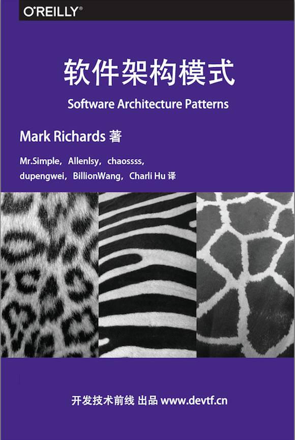
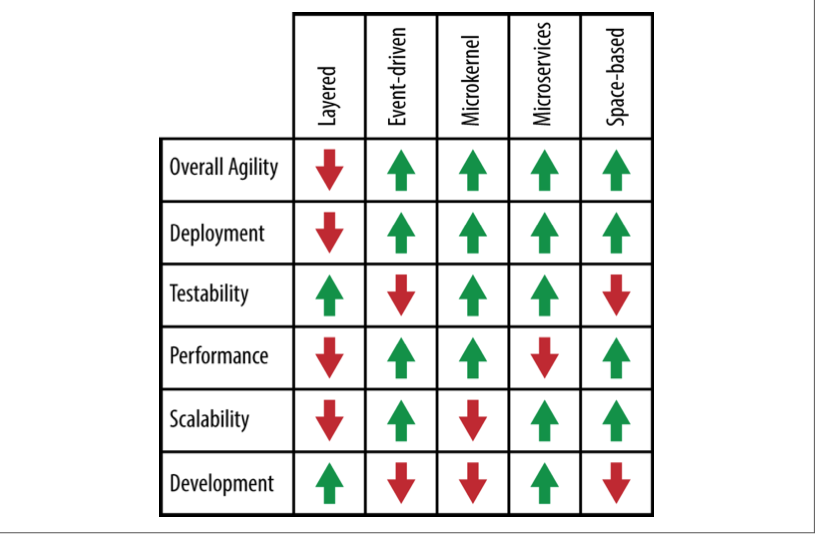

软件架构模式  Mark Richards 著      
版权归 © 2015 O’Reilly Media, Inc. 所有.      

原书发布链接为[Software Architecture Patterns](http://www.oreilly.com/programming/free/software-architecture-patterns.csp).

**译者信息**

|  译者  |  个人简介  |
|--------|----------|
|  [Mr.Simple](https://github.com/bboyfeiyu)   | 乐于分享，热爱开源的工程师，[个人博客](http://blog.csdn.net/bboyfeiyu) |
|   |  |

# 目录
* [简介](#introdution) 
* [第一章 分层架构](#chapter1)
* [第二章 事件驱动架构](#chapter2)
* [第三章 微内核架构](#chapter3)
* [第四章 微服务架构](#chapter4)
* [第五章 基于空间的架构](#chapter5)
* [附录A](#appendix)
* [关于作者](#author)

<b id="introdution"/>
## 简介

对程序员来说很常见一种情况是在没有一个合理的程序架构时就开始编程，没有一个清晰的和定义好的架构的时候，大多数开发者和架构师通常会使用标准式的传统分层架构模式（也被称为多层架构）——通过将源码模块分割为几个不同的层到不同的包中。不幸的是，这种编码方式会导致一系列没有组织性的代码模块，这些模块缺乏明确的规则、职责和同其他模块之间的关联。这通常被称为架构大泥球。  

应用程序缺乏合理的架构一般会导致程序耦合性很紧、容易被破坏、难以应对变化，同时很难有一个清晰的版本或者方向性。这样的结果是，如果你没有充分理解程序系统里每个组件和模块，就很难定义这个程序的结构特征。有关于程序的部署和维护的基本问题都难以回答，比如：程序架构是什么规模?应用程序有什么性能特点?应用程序有多容易应对变化?应用程序的部署特点是什么?架构是如何反应的?

架构模式帮助你定义应用程序的基本特征和行为。例如，一些架构模式会让程序自己自然而然地朝着具有良好伸缩性的方向发展，而其他架构模式会让程序朝着高度灵活的方向发展。知道了这些特点，了解架构模式的优点和缺点是非常必要的，它帮助我们选择一个适合自己特定的业务需求和目标的的程序。
    
作为一个架构师,你必须证明你的架构模式的决策是正确的,特别是当需要选择一个特定的体系结构模式或方法的时候。这本迷你书的目的就是给你足够的信息让你去做出正确的架构决策。

<b id="chapter1"/>
## 第一章 分层架构
在应用开发中最为常用的架构模式就是分层架构，它的另一个名字就是N层架构模式。这个模式是很多javaEE程序的标准模式，因此它广为人知，包括很多架构师，设计师，工程师。分层架构模式与传统的IT通信和很多公司的组织结构非常的相似，使得它成为很多商业应用最为自然的选择。 

### 模式描述

<b id="chapter2"/>
## 第二章 事件驱动架构

<b id="chapter3"/>
## 第三章 微内核架构

<b id="chapter4"/>
## 第四章 微服务架构

<b id="chapter5"/>
## 第五章 基于空间的架构

# APPENDIX A #
## Pattern Analysis Summary 
Figure A-1 summarizes the pattern-analysis scoring for each of the
architecture patterns described in this report. This summary will
help you determine which pattern might be best for your situation.
For example, if your primary architectural concern is scalability, you
can look across this chart and see that the event-driven pattern,
microservices pattern, and space-based pattern are probably good
architecture pattern choices. Similarly, if you choose the layered
architecture pattern for your application, you can refer to the chart
to see that deployment, performance, and scalability might be risk
areas in your architecture.
45

<b id="appendix" />
## 附录A 
### 模式分析总结
图A-1 总结了在这个报告中，对于架构模式的每部分进行的模式分析所产生的影响。这个总结帮助你确定哪些模式可能是最适合你的情况。例如,如果你的架构模式重点是可伸缩性，你可以在这个图表看看事件驱动模式,microservices模式,和基于空间模式，这些对于你来说可能是很好的架构模式的选择。同样的,如果你的程序注重的是分层架构模式,你可以参考图看到部署、性能和可伸缩性的在你的架构中所存在的风险。

     
图 A-1 模式分析总结     

While this chart will help guide you in choosing the right pattern,
there is much more to consider when choosing an architecture pattern.
You must analyze all aspects of your environment, including
infrastructure support, developer skill set, project budget, project
deadlines, and application size (to name a few). Choosing the right
architecture pattern is critical, because once an architecture is in
place, it is very hard (and expensive) to change

同时这个图表将指导你选择正确的模式,因为在选择一种架构模式的时候，有更多的需要考虑。你必须分析你的环境的各个方面,包括基础设施的支持,开发人员技能,项目预算,项目最后期限,和应用程序大小等等。选择正确的架构模式是至关重要的,因为一旦一个架构被确定就很难改变。

## About the Author
Mark Richards is an experienced, hands-on software architect
involved in the architecture, design, and implementation of microservices
architectures, service-oriented architectures, and distributed
systems in J2EE and other technologies.
 He has been in the
software industry since 1983 and has significant experience and
expertise in application, integration, and enterprise architecture.
Mark served as the president of the New England Java Users Group
from 1999 through 2003.
 He is the author of numerous technical books and videos, including Software Architecture Fundamentals
(O’Reilly video), Enterprise Messaging (O’Reilly video), Java
Message Service, 2nd Edition (O’Reilly), and a contributing author
to 97 Things Every Software Architect Should Know (O’Reilly).
Mark has a master’s degree in computer science and numerous
architect and developer certifications from IBM, Sun, The Open
Group, and BEA. 
He is a regular conference speaker at the No
Fluff Just Stuff (NFJS) Symposium Series and has spoken at more
than 100 conferences and user groups around the world on a variety
of enterprise-related technical topics. 
When he is not working,
Mark can usually be found hiking in the White Mountains or
along the Appalachian Trail.

<b id="author" />
## 关于作者 
Mark•Richards是一位有实际经验的软件架构师，他参与架构、设计和实施microservices体系结构、面向服务的体系结构和在J2EE中的分布式系统和其他技术。自1983年以来，他一直从事软件行业,有大量的经验和专业知识在应用、集成和企业架构方面。    

Mark从1999年到2003担任新英格兰Java用户组的主席。他是许多技术书籍和视频的作者,包括软件架构基础(O‘Reilly视频)、企业消息传递(O'Reilly视频),《Java消息服务，第二版》(O'Reilly)和《软件架构师应该知道的97件事》(O'Reilly)的特约作者。Mark有一个计算机科学硕士学位和很多从IBM、Sun、开放
集团和BEA获得的架构师和开发人员认证。   

他是Fluff Just Stuff(NFJS)研讨会系列（一个不定期会议）议长,并且超过100多次在世界各地的公益的会议和用户组上围绕技术主题发言。当他不工作时,Mark通常会在白色山脉或阿帕拉契山径徒步旅行。

